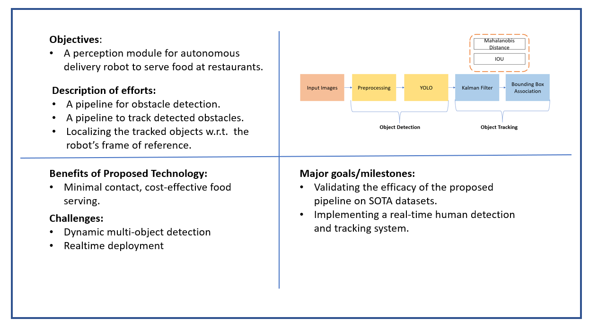
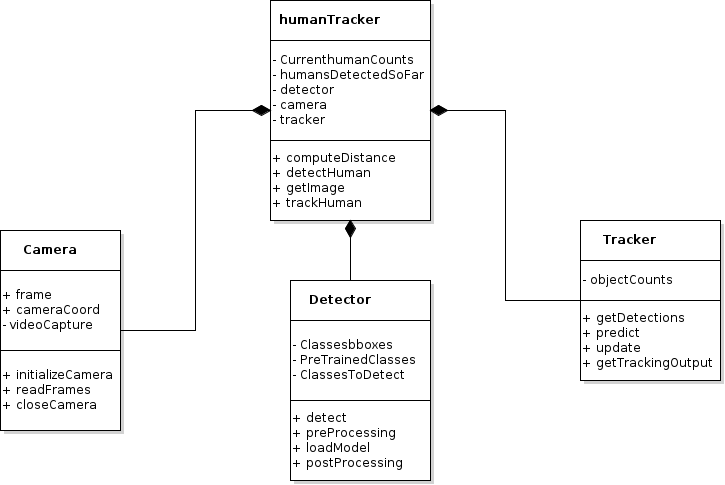
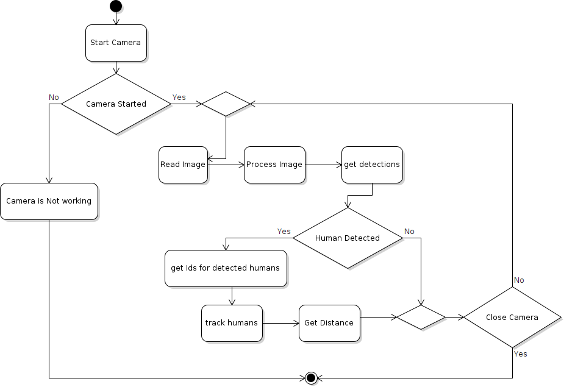

# ENPM808X: Midterm Project - Robo-Butler

## Authors

**Design Keeper:** Yashveer Jain 

**Navigator:** Pavan Mantripragada 

**Driver:** Tharun V. Puthanveettil

## Overview
In recent years, because of covid pandemic, there are problems related to  the shortage of staff, and maintaining the social distancing norm in restaurant, and it becomes challenging for a restaurant business to sustain. So, to mitigate the problem we introduce the "Robo-Butler". Robo-butler is a cost-efficient fully autonomous robot that serves food to the customers' table from the kitchen in a restaurant with minimal contact thereby ensuring maximum hygiene. It localizes and track human motion to prevent potential collisions which are possible in a social environment like at the restaurants.

## Quadchart 

## UML Class Diagram 

## UML Activity Diagram 

## Submission Video

Click [here](https://drive.google.com/drive/folders/1OGrv_k7kIViHYJe9wSSLsaUbflmXJ6Xp?usp=sharing) to go to the folder containing the video

