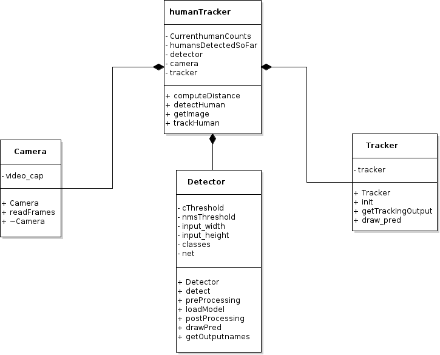

# ROBOBUTLER (ENPM808X: Midterm Project)

<!-- [](https://github.com/tvpian/ENPM808X_Midterm_Project/actions) -->
<!--  -->
[](https://opensource.org/licenses/MIT)
[](https://github.com/TommyChangUMD/cpp-boilerplate/actions/workflows/build_and_coveralls.yml)
[](https://coveralls.io/github/tvpian/ENPM808X_Midterm_Project)

## Authors

**Design Keeper:** Yashveer Jain 

**Navigator:** Pavan Mantripragada 

**Driver:** Tharun V. Puthanveettil

## Overview
In recent years, because of covid pandemic, there are problems related to  the shortage of staff, and maintaining the social distancing norm in restaurant, and it becomes challenging for a restaurant business to sustain. So, to mitigate the problem we introduce the "Robo-Butler". Robo-butler is a cost-efficient fully autonomous robot that serves food to the customers' table from the kitchen in a restaurant with minimal contact thereby ensuring maximum hygiene. It localizes and track human motion to prevent potential collisions which are possible in a social environment like at the restaurants.

## Quadchart 


## UML Class Diagram 



## UML Activity Diagram 


## Standard install via command-line
```
git clone --recursive https://github.com/dpiet/cpp-boilerplate
cd <path to repository>
mkdir build
cd build
cmake ..
make
Run tests: ./test/cpp-test
Run program: ./app/shell-app
```

## Building for code coverage (for assignments beginning in Week 4)
```
sudo apt-get install lcov
cmake -D COVERAGE=ON -D CMAKE_BUILD_TYPE=Debug ../
make
make code_coverage
```
This generates a index.html page in the build/coverage sub-directory that can be viewed locally in a web browser.

## Product Backlog
Click [here](https://docs.google.com/spreadsheets/d/153fBiMFGLif_XUhouHLDlejJ7nZ2Hm-PPDNQ9VNdo48/edit?usp=sharing)

## Submission Video

### Phase 0
Click [here](https://drive.google.com/drive/folders/1OGrv_k7kIViHYJe9wSSLsaUbflmXJ6Xp?usp=sharing) to go to the folder containing the video

### Phase 1
Click [here](https://drive.google.com/file/d/1J_7hdJ3Lzeyr3CzfL9PiiMlyiiKA-co0/view?usp=sharing)